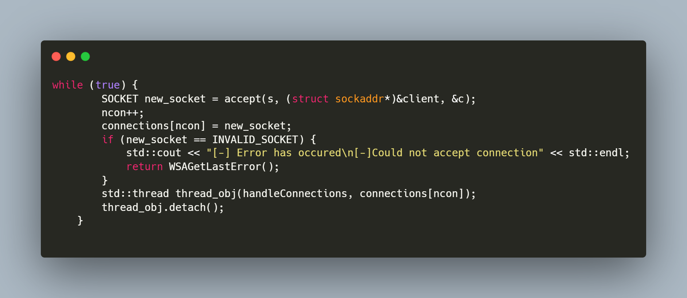

  

 

Client-Server implementation of a networked printing service for handling vast amounts of print requests coming from users with different levels of privileges and priorities.

[Further Information](./NetPrint_Report.docx)

# Specifications

## Packet Composition

A 1996 bytes payload size with a 4 bytes header, are enough to fit simple print requests.
Protocol codes, placed in the header, need to be defined in order to identify and process requests accordingly.

## Priority Data Structure
Print requests need to be handled based on priority.

## Multithreading
To be able to handle multiple users simultaneously, multithreading was utilized.

## Mutual Exclusion using Semaphores
Sempaphores were used to avoid two threads using the same Data simultaneously and to achieve uninterrupted printing.

# Usage Example
